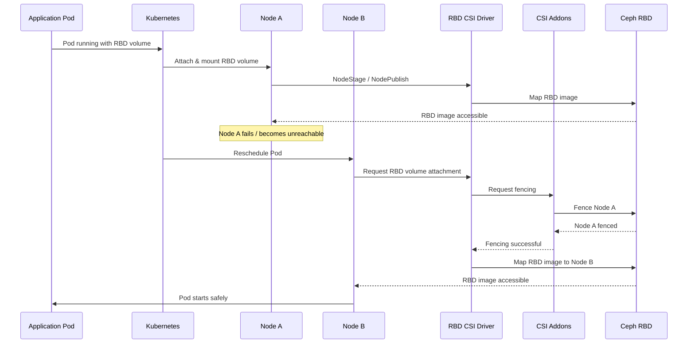
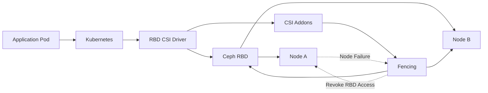

# fencing

```mermaid
sequenceDiagram
    participant App as Application Pod
    participant K8s as Kubernetes
    participant NodeA as Node A
    participant NodeB as Node B
    participant CSI as RBD CSI Driver
    participant Addons as CSI Addons
    participant Ceph as Ceph RBD

    App->>K8s: Pod running with RBD volume
    K8s->>NodeA: Attach & mount RBD volume
    NodeA->>CSI: NodeStage / NodePublish
    CSI->>Ceph: Map RBD image
    Ceph-->>NodeA: RBD image accessible

    Note over NodeA: Node A fails / becomes unreachable

    K8s->>NodeB: Reschedule Pod
    NodeB->>CSI: Request RBD volume attachment

    CSI->>Addons: Request fencing
    Addons->>Ceph: Fence Node A
    Ceph-->>Addons: Node A fenced

    Addons-->>CSI: Fencing successful
    CSI->>Ceph: Map RBD image to Node B
    Ceph-->>NodeB: RBD image accessible

    NodeB->>App: Pod starts safely
```

```mermaid
flowchart LR
    Pod[Application Pod]
    K8s[Kubernetes]
    CSI[RBD CSI Driver]
    Addons[CSI Addons]
    Fence[Fencing]
    Ceph[Ceph RBD]
    NodeA[Node A]
    NodeB[Node B]

    Pod --> K8s
    K8s --> CSI
    CSI --> Ceph
    CSI --> Addons
    Addons --> Fence
    Fence --> Ceph

    Ceph --> NodeA
    Ceph --> NodeB

    NodeA -. Node Failure .-> Fence
    Fence -. Revoke RBD Access .-> NodeA
    Fence --> NodeB
```
